:data-uri:
:toc2:

:numbered!:
[abstract]
== Integration of BPMS with Red Hat SSO

:numbered:

== Introduction

BPM Suite 6 comes with two different runtimes. +
There is _Business-Central_, a feature-complete workbench application that covers the design-time (authoring of business processes and business rules artifacts) as well as the runtime aspects (deployment, monitoring). +
_KIE Server_ on the other hand is a pure runtime component, meant to be used a remote business rules and process execution engine. In the first releases of BPM Suite 6 KIE Server was focused solely on business rules execution, but since BPMS 6.2 KIE Server also supports business process execution.

Out of the box KIE Server offers two remote APIs to interact with business processes and rules: REST/HTTP and JMS.

The REST API is particularly suited when using KIE Server in combination with a front-end application. As REST is language and platform agnostic, you can use any tools and platform to develop such a front-end. In this lab we will use a AngularJS web application as a frontend to a KIE Server instance. From that front-end we will be able to start process instances and interact with human tasks.

== BPM Suite 6 and Red Hat SSO

One of the challenges when combining KIE Server with a custom front-end is how to handle security.

Out of the box, the REST API of KIE Server requires authentication, and is configured for BASIC authentication.

This configuration has several issues:

* For every REST call from the front-end to the back-end KIE Server the username and password needs to be included, in an _Authorization_ header. For BASIC auth, the username/password combination is passed in clear, base64 encoded text.
* This means that the front end application needs to know and have access to the user names and passwords.

KIE Server allows to log in as a _system user_, and perform operations on behalf of the real user, whose username is passed in as a query parameter in the REST calls. So if KIE Server is configured to bypass the real user, only the username and password of the system user needs to be known by the front-end. +
This is already more practical, but still not a very good solution: you would still need to somehow hard-code the system user password in the front-end, and you can not really restrict access to the KIE Server based on the real user. Once you know the system user's username and password, yuo can gain access to the KIE Server.

A way better solution to this problem is to use a Single Sign On solution (SSO).

In this case the user, when accessing the front-end application, is redirected to the SSO server, where he needs to log in. On succesful login, a token is issued by the SSO server. This token contains the username and the roles attributed to this user. Whenever the front-end application accesses the KIE Server backend, the token is passed to the KIE Server as a HTTP header. On the KIE Server, the token is verified, and if valid, access is granted to the user.

Red Hat SSO is an integrated SSO and IDM solution for browser apps and RESTful web services.  It is built on top of the OAuth 2.0, Open ID Connect, JSON Web Token (JWT) and SAML 2.0 specifications. +
BPM Suite 6.3 comes with a tech preview of Red Hat SSO (which at the moment of writing has not yet been GA'ed as a product). +
The upstream project of Red Hat SSO is Keycloak (http://keycloak.jboss.org/).

== Prerequisites

The remainder of this documentation provides instructions for installation, configuration and execution of this lab on your local machine (or a virtual machine).

You should have the following installed on your local or virtual machine:

* Java JDK 1.8 +
To verify correct installation:
+
----
$ java -version
openjdk version "1.8.0_91"
OpenJDK Runtime Environment (build 1.8.0_91-b14)
OpenJDK 64-Bit Server VM (build 25.91-b14, mixed mode)
----
* Git (to clone this repository) +
To verify correct installation
----
$ git --version
git version 2.5.5
----
* Maven version 3.2.5 or later. See https://maven.apache.org/ for download and installation instructions. +
To verify correct installation:
+
----
$ mvn -v
mvn -v
Apache Maven 3.2.5 (12a6b3acb947671f09b81f49094c53f426d8cea1; 2014-12-14T18:29:23+01:00)
Maven home: /home/bernard/apps/maven/apache-maven-3.2.5
Java version: 1.8.0_91, vendor: Oracle Corporation
Java home: /usr/lib/jvm/java-1.8.0-openjdk-1.8.0.91-6.b14.fc23.x86_64/jre
Default locale: en_US, platform encoding: UTF-8
OS name: "linux", version: "4.5.5-201.fc23.x86_64", arch: "amd64", family: "unix"
----
* Node.js and npm (we use these to develop, build and run the AngularJS frontend). See https://nodejs.org/en/ for download and installation instructions. +
To verify correct installation:
+
----
$ node --version && npm --version
v4.4.5
3.9.5
----

As part of this lab we also provide a fully configured installation using Docker images, and orchestrated with docker-compose. Instructions for running these Docker images are provided at the end of this documentation.

== Installation

=== BPMS Suite 6

BPMS Suite 6 can be downloaded from the Red Hat Customer Portal (login required). We will need the following components:

* EAP 6.4 : https://access.redhat.com/jbossnetwork/restricted/softwareDetail.html?softwareId=37393&product=appplatform&version=6.4&downloadType=distributions
* EAP 6.4 Cumulative Patch 8 : https://access.redhat.com/jbossnetwork/restricted/softwareDetail.html?softwareId=44441&product=appplatform&version=6.4&downloadType=patches
* BPM Suite Deployable for EAP 6 : https://access.redhat.com/jbossnetwork/restricted/softwareDetail.html?softwareId=43731&product=bpm.suite&version=&downloadType=distributions

Installation:

. Unzip the `jboss-eap-6.4.0.zip` EAP distribution file somewhere on your file system. We'll refer to the `jboss-eap-6.4` directory within the directory where you unzipped EAP as <BPMS_HOME>.
. Apply the Cumulative Patch 08 for EAP 6.4
.. In a terminal window, `cd` to `<BPMS_HOME>/bin`
.. Apply the patch:
+
----
$ ./jboss-cli.sh "patch apply <path to downloaded patch>"
----
+
Replace `<path to downloaded patch>` with the path to the downloaded EAP patch file.
. Install BPM Suite 6 on top of EAP. Unzip the `jboss-bpmsuite-6.3.0.GA-deployable-eap6.x.zip` BPMS distribution archive to the same directory as you used for unzipping EAP. Overwrite existing files.
. As we will only use KIE Server in this lab, we can remove Business-Central and DashBuilder. From `<BPMS_HOME>`:
+
----
$ rm standalone/deployments/business-central.war.dodeploy
$ rm standalone/deployments/dashbuilder.war.dodeploy
----
. Create a user for KIE Server.
.. Open `<BPMS_HOME>/standalone/configuration/application-users.properties` for editing, and add the following line:
+
----
admin1=8b68b1984bd2f4faf6b7a3c6a0c78968
----
+
This creates a user `admin` with password `admin`. Save the file.
+
.. Open `<BPMS_HOME>/standalone/configuration/application-roles.properties` for editing, and add the following line:
+
----
admin1=kie-server
----
+
Save the file.
. Start BPMS Suite 6. To avoid port conflicts with the RH SSO server, we will use a port offset of 150. +
Open a terminal, `cd` to `<BPMS_HOME>/bin` and execute:
+
----
$ ./standalone.sh -Djboss.socket.binding.port-offset=150
----
. Once BPMS Suite 6 is started up, you can verify that KIE Server is running correctly. +
In a browser, navigate to `localhost:8230/kie-server/services/rest/server`. Log in with the `admin1:admin` user. +
You should see something like:
+
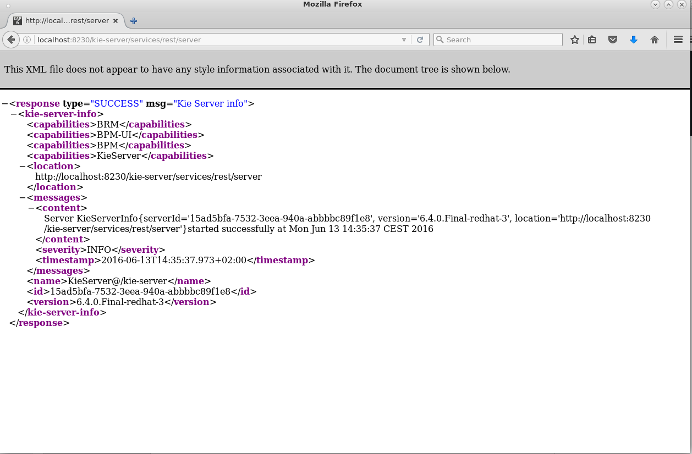

=== Red Hat SSO 7.0 Early Access Server

Red Hat SSO 7.0 Early Access Server can be downloaded from the Red Hat Customer Portal. We will need the following components:

* Red Hat Single Sign-On 7.0.0 Early Access Server: https://access.redhat.com/jbossnetwork/restricted/softwareDetail.html?softwareId=43811&product=bpm.suite&version=&downloadType=distributions
* Red Hat Single Sign-On 7.0.0 Early Access Client Adapter for EAP 6 : https://access.redhat.com/jbossnetwork/restricted/softwareDetail.html?softwareId=43801&product=bpm.suite&version=&downloadType=distributions
* Red Hat Single Sign-On 7.0.0 Early Access Javascript Adapter : https://access.redhat.com/jbossnetwork/restricted/softwareDetail.html?softwareId=43791&product=bpm.suite&version=&downloadType=distributions

Installation:

. Unzip the `rh-sso-7.0.0.ER9.zip` RH SSO distribution file somewhere on your file system. We'll refer to the `RH-SSO-7.0.0.ER9` directory within the directory where you unzipped RHSSO as <RHSSO_HOME>.
. Create a file called `keycloak-add-user.json` in the `<RHSSO_HOME>/standalone/configuration` directory. +
Copy the following content into this file:
+
----
[ {
  "realm" : "master",
  "users" : [ {
    "username" : "admin",
    "enabled" : true,
    "credentials" : [ {
      "type" : "password",
      "hashedSaltedValue" : "vxd6aePwVDCPEe4/dJyNpK36yV3U/bYjOpqimeVrmrfk04qPIWJiCoFnv/ryD7wHDSBuSh3Y52PtM2X/KxvtaQ==",
      "salt" : "tFqpn2fxArWBVxtreP6ECQ==",
      "hashIterations" : 100000,
      "algorithm" : "pbkdf2"
    } ],
    "realmRoles" : [ "admin" ]
  } ]
} ]
----
+
This will create an initial user `admin` with password `admin` in the master realm of the RH SSO server at server startup.
. Start up the RH SSO server. +
Open a terminal, `cd` to `<RHSSO_HOME>/bin` and execute:
+
----
$ ./standalone.sh
----
. When the RH SSO server is started, open a browser and navigate to `localhost:8080/auth/admin`. Login with user `admin:admin`. +
You should see something like:
+
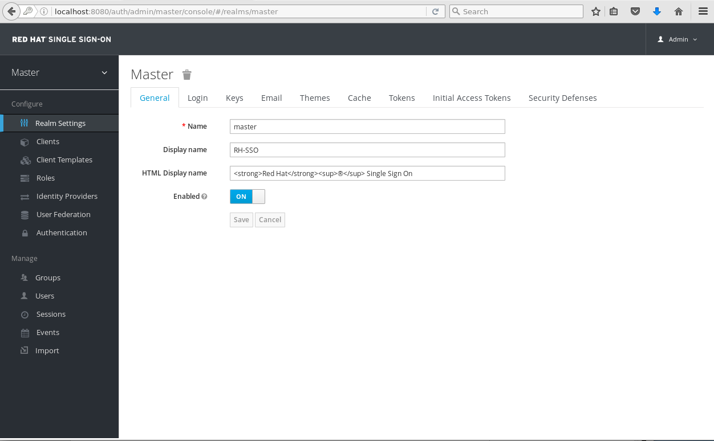

== RH SSO configuration

=== Create a realm

First step is to create a SSO realm for our application.

. On the RH SSO start screen, hover over the Realm dropdown. Click on the `Add Realm` button.
. In the `Name` field, type `kieserver`. Leave `Enabled` to `ON`.
+
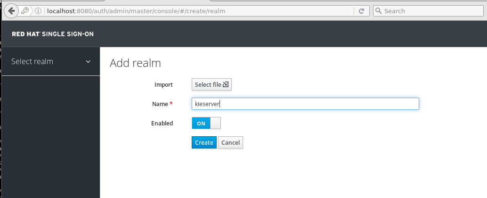
+
Click `Create`.
. On the `Kieserver` realm page, select the `Login` tab. Set the `Require SSL` dropdown box to `none`. Click `Save`.
+
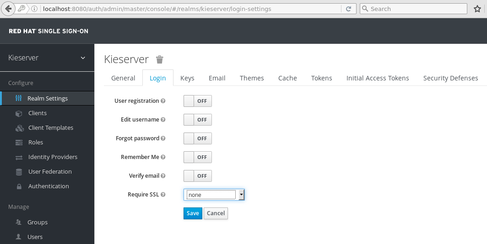
+
Note: on a production system it is strongly recommended to use SSL for all communication between the applications and the RH SSO server.

=== Create Clients

For each of the applications involved (AngularJS front-end, KIE Server back-end) we need to create a client configuration in our realm. We will also create a client for curl to be able to access the KIE Server REST API from the command line.

. On the `Kieserver` realm page, select the `Clients` menu option. +
A number of client configurations are predefined. Leave these as-is.
. Click the `Create` button on the top right to create a new client.
. Fill in the following values:
* Client Id : `frontend`
* Client Protocol : leave to `openid-connect`
* Client Template : leave blank
* Root URL : leave blank
+
Click `Save`.
. On the `Settings` tab of the client page for the `frontend` client, enter the following values:
* Access type : `confidential`
* Valid Redirect URIs : Add `http://localhost:8000/*`
* Web Origins : Add `http://localhost:8000`
+
Click `Save`. +
Access type _confidential_ means that a secret is required to initiate the login protocol. +
_http://localhost:8000_ is the URI of the AngularJS frontend application.
+
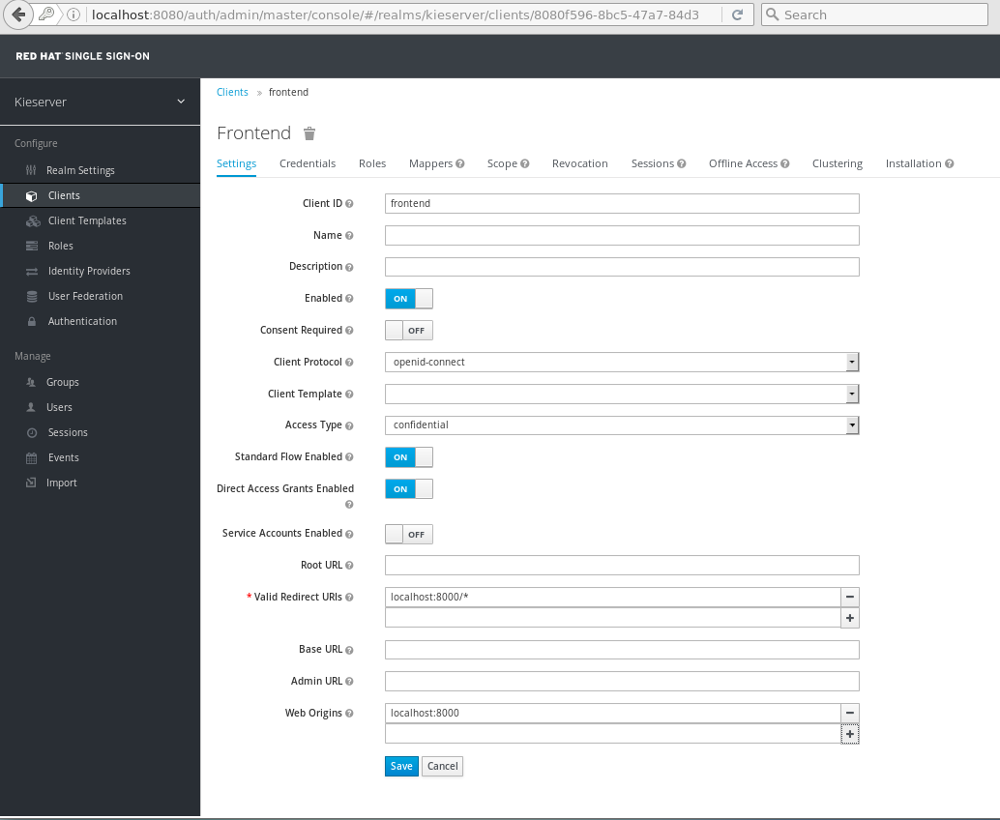
. Create the `kieserver` client. +
On the settings page, enter the following values:
* Access type: `bearer only`
+
Click `Save` +
A `bearer only` client is used for web services that will not initiate a login, but require a valid token to grant access.
. Finally, create the `curl` client. +
On the settings page, enter the following values:
* Access type: `public`
* Valid Redirect URIs : `http://localhost`
+
Click `Save` +
The _curl_ client will allow us to obtain a valid token from the RH SSO server using curl. This token can then be used to access the KIE Server REST API. This is probably something you will not allow on a production system, or at least restricted to select users.

=== Create Roles

Authorization is determined by the roles of the user. To be able to access the KIE Server REST APIs, a user must have the role `kie-server`.

We will also create some application-specific roles for use within KIE Server.

. On the `Kieserver` realm page, select the `Roles` menu option.
. Click the `Add Role` button on the top right to create a new user.
. Set Role name `kie-server`
. Click `Save`.
. Repeat to create application roles (e.g. `group1, group2`).

=== Create Users

Next step is to create some users.

. On the `Kieserver` realm page, select the `Users` menu option.
. Click the `Add User` button on the top right to create a new user.
. On the `Add user` page, enter a username, e.g. `user1`. +
Leave the other fields as-is. +
Click `Save`.
+
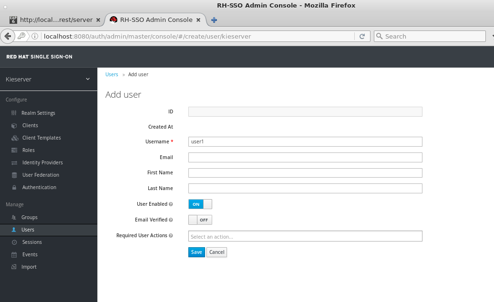
. On the `Credentials` tab for the newly created user, enter a value for the user password (e.g. `user`) and confirm. Set the `Temporary` switch to off. +
The `Temporary` switch determines whether the user will have to change his password at first login.
+
Click `Reset password`
+
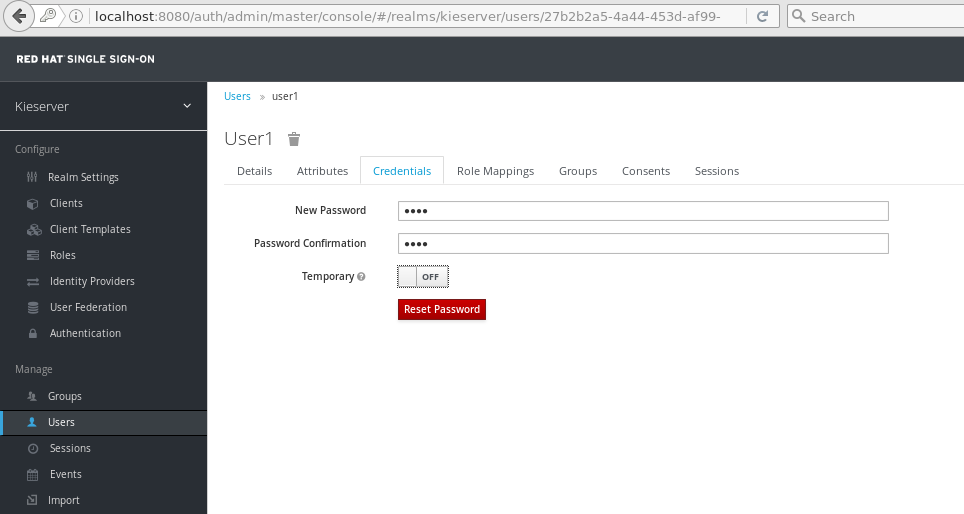
. Click on the `Role Mappings` tab to associate the user with roles. +
Make sure the user has the `kie-server` role, and one or more application roles. +
Click `Save`.
+
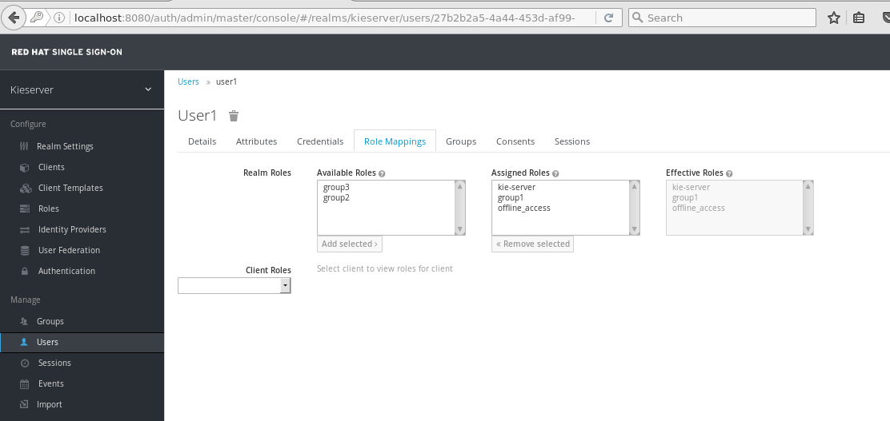

. Repeat to create some more users.

=== Import the RH SSO configuration

Rather than entering the RH SSO assets (realms, clients, users, roles) by hand, they can be imported at startup from one or more JSON files.

In the `rhsso/import` directory of this repository you'll find the JSON files for the `kieserver` realm and the users defined for this realm.

All users have the password `user`.

To import the files in to the RH SSO server:

. Shutdown the RH SSO server. +
Hit `Ctrl-C` in the terminal window where you started RH SSO.
. Start the RH SSO server with the following environment variables (replace _</path/to/rhsso/import/directory>_ with the path to the `rhsso/import` folder):
+
----
$ ./standalone.sh -Dkeycloak.migration.action=import -Dkeycloak.migration.provider=dir -Dkeycloak.migration.strategy=OVERWRITE_EXISTING -Dkeycloak.migration.dir=</path/to/rhsso/import/directory>
----
. Log into the RH SSO server with user `admin:admin`, and verify that the import of the `kieserver` realm has been successful.

== KIE Server configuration

=== RH SSO Client Adapter for EAP 6 installation

First thing we need to do is to install the RH SSO client adapter on the KIE Server instance. The installation adds a new security domain that we will be used by KIE Server in lieu of the the out-of-the-box security domain that uses property files for user and role configuration.

. If needed, shut down the KIE Server instance +
Hit `Ctrl-c` in the terminal window where you started BPMS.
. Unzip the `keycloak-eap6-adapter-dist-1.9.7.Final-redhat-1.zip` archive to the `<BPMS_HOME>` directory.
. Start the BPMS instance in admin-only mode. +
In a terminal window, `cd` to `<BPMS_HOME>/bin`, and execute the following command:
+
----
$ ./standalone.sh -Djboss.socket.binding.port-offset=150 --admin-only
----
. Using the EAP CLI, execute the RH SSO adapter installation script. +
In a new terminal window, `cd` to `<BPMS_HOME>/bin`, and execute the following command:
+
----
$ ./jboss-cli.sh -c --controller=localhost:10149 --file=adapter-install.cli
{"outcome" => "success"}
{"outcome" => "success"}
{"outcome" => "success"}
{"outcome" => "success"}
$ ./jboss-cli.sh -c --controller=localhost:10149 ":shutdown"
{"outcome" => "success"}
----

=== KIE Server war web.xml configuration

Next we need to configure the KIE Server application to use the RH SSO security domain.

. Open the `<BPMS_HOME>/standalone/depoyments/kie-server.war/WEB-INF/web.xml` file for editing. +
Replace:
+
----
<login-config>
  <auth-method>BASIC</auth-method>
  <realm-name>KIE Server</realm-name>
</login-config>
----
+
With:
+
----
<login-config>
  <auth-method>KEYCLOAK</auth-method>
  <realm-name>KIE Server</realm-name>
</login-config>
----
+
Save the file.
. Log into the RH SSO server with user `admin:admin`, select the `Kieserver` realm. Go the `Clients` section, open the `kieserver` client, and click on the `Installation`. +
Select the `Keycloak OIDC JSON` format, and click on the Download button.
+
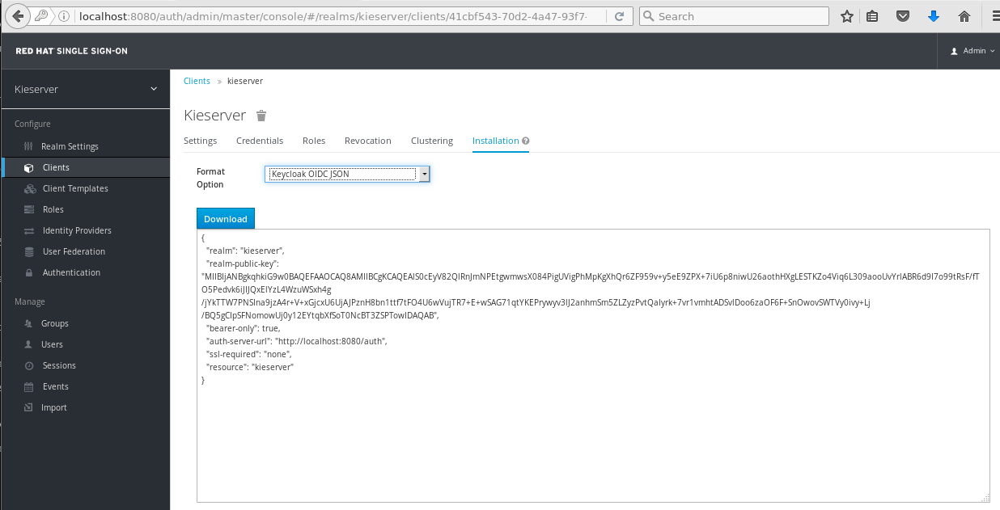
+
Save the file on your filesystem.
. Copy the downloaded JSON configuration file to the `<BPMS_HOME>/standalone/depoyments/kie-server.war/WEB-INF/` directory.
. Open the `<BPMS_HOME>/standalone/depoyments/kie-server.war/WEB-INF/` file for editing.
.. Replace `"auth-server-url": "http://localhost:8080/auth"` with `"auth-server-url": "http://127.0.0.1:8080/auth"`
.. Add the following block after `"resource": "kieserver"`. Don't forget to add a comma after `"resource": "kieserver"`:
+
----
  "enable-cors" : true,
  "cors-max-age" : 1000,
  "cors-allowed-methods" : "POST, PUT, DELETE, GET"
----
+
After the changes the file contents should look like:
+
----
{
  "realm": "kieserver",
  "realm-public-key": "MIIBIjANBgkqhkiG9w0BAQEFAAOCAQ8AMIIBCgKCAQEAlS0cEyV82QlRnJmNPEtgwmwsX084PigUVigPhMpKgXhQr6ZF959v+y5eE9ZPX+7iU6p8niwU26aothHXgLESTKZo4Viq6L309aooUvYrlABR6d9I7o99tRsF/fTO5Pedvk6iJIJQxElYzL4WzuWSxh4g/jYkTTW7PNSIna9jzA4r+V+xGjcxU6UjAJPznH8bn1ttf7tFO4U6wVujTR7+E+wSAG71qtYKEPrywyv3lJ2anhmSm5ZLZyzPvtQaIyrk+7vr1vmhtADSvlDoo6zaOF6F+SnOwovSWTVy0ivy+Lj/BQ5gCIpSFNomowUj0y12EYtqbXfSoT0NcBT3ZSPTowIDAQAB",
  "bearer-only": true,
  "auth-server-url": "http://127.0.0.1:8080/auth",
  "ssl-required": "none",
  "resource": "kieserver",
  "enable-cors" : true,
  "cors-max-age" : 1000,
  "cors-allowed-methods" : "POST, PUT, DELETE, GET"
}
----
+
The `enable-cors` setting enables CORS support by the RH SSO adapter. It will handle preflight requests and set the required HTTP headers. This is expecially important when accessing the KIE Server APIs through Javascript in a browser, as is the case for our AngularJS client app. For a good overview of  CORS, refer to http://www.html5rocks.com/en/tutorials/cors/
. Restart the KIE Server instance. +
In a terminal window, `cd` to `<BPMS_HOME>/bin`, and execute the following command:
+
----
$ ./standalone.sh -Djboss.socket.binding.port-offset=150
----
. To test that basic authentication does not longer work, in a browser, try to navigate to `localhost:8230/kie-server/services/rest/server`. +
You should receive a _HTTP Status 401_ error (not authorized).
. To verify the correct setup, open a terminal window and execute the following commands:
+
----
$ export TKN=$(curl -X POST 'http://127.0.0.1:8080/auth/realms/kieserver/protocol/openid-connect/token' \
 -H "Content-Type: application/x-www-form-urlencoded" \
 -d "username=user1" \
 -d 'password=user' \
 -d 'grant_type=password' \
 -d 'client_id=curl'| sed 's/.*access_token":"//g' | sed 's/".*//g')
----
+
----
$ echo $TKN
----
+
You should see the value of the token received from the RH SSO server. +
Next execute:
+
----
$ curl -X GET 'http://127.0.0.1:8230/kie-server/services/rest/server' \
> -H "Accept: application/json" \
> -H "Authorization: Bearer $TKN"
----
+
You should see the response received by the KIE Server:
+
----
{
  "type" : "SUCCESS",
  "msg" : "Kie Server info",
  "result" : {
    "kie-server-info" : {
      "version" : "6.4.0.Final-redhat-3",
      "name" : "KieServer@/kie-server",
      "location" : "http://localhost:8230/kie-server/services/rest/server",
      "capabilities" : [ "BRM", "BPM-UI", "BPM", "KieServer" ],
      "messages" : [ {
        "severity" : "INFO",
        "timestamp" : 1466005104110,
        "content" : [ "Server KieServerInfo{serverId='15ad5bfa-7532-3eea-940a-abbbbc89f1e8', version='6.4.0.Final-redhat-3', location='http://localhost:8230/kie-server/services/rest/server'}started successfully at Wed Jun 15 17:38:24 CEST 2016" ]
      } ],
      "id" : "15ad5bfa-7532-3eea-940a-abbbbc89f1e8"
    }
  }
----
+
The first `curl` command obtains a token from the RH SSO for user1, using the curl client, and extracts the token value from the response. The second `curl` command calls the KIE Server REST API passing the token as an authorization header. The RH SSO security system on KIE Server verifies the validity of the token, and extracts the user id and roles. If the user in the token has the correct roles (`kie-server`), access is granted.

=== Deploy the test archive on KIE Server.

To demonstrate how a client application can interact with KIE Server, we have included a process archive in this repository, in the `process-kjar` folder.

This process has a simplistic ticket handling process definition, with one human task. Users can create ticket process instances, and assign them to one or more groups. This will create a human task that can be claimed and completed by users belonging to the assigned groups.

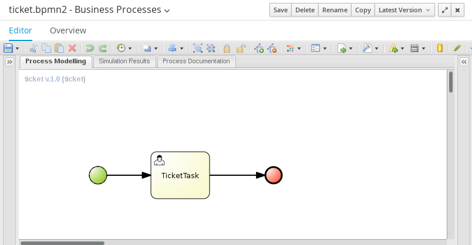

To deploy this process archive, we need first to build it with maven, and to deploy it to the local maven repository.

. In a terminal window, `cd` to the `process-kjar` directory.
. Execute the following command:
+
----
$ cd ticket-app/ticket-kjar
$ mvn clean install
----
. Deploy the ticket process kjar on KIE Server. +
Execute the following commands
+
To obtain a token:
+
----
export TKN=$(curl -X POST 'http://localhost:8080/auth/realms/kieserver/protocol/openid-connect/token' \
 -H "Content-Type: application/x-www-form-urlencoded" \
 -d "username=user1" \
 -d 'password=user' \
 -d 'grant_type=password' \
 -d 'client_id=curl'| sed 's/.*access_token":"//g' | sed 's/".*//g')
----
+
To deploy the process kjar:
+
----
curl -X PUT 'http://localhost:8230/kie-server/services/rest/server/containers/ticket-app' \
-H "Accept: application/json" \
-H "Content-type: application/json" \
-H "Authorization: Bearer $TKN" \
-d '{"release-id" : {"group-id" : "com.redhat.gpte", "artifact-id" : "ticket-kjar", "version" : "1.0" } }'
----
+
Expected response:
+
----
{
  "type" : "SUCCESS",
  "msg" : "Container ticket-app successfully deployed with module com.redhat.gpte:ticket-kjar:1.0.",
  "result" : {
    "kie-container" : {
      "status" : "STARTED",
      "messages" : [ ],
      "container-id" : "ticket-app",
      "release-id" : {
        "version" : "1.0",
        "group-id" : "com.redhat.gpte",
        "artifact-id" : "ticket-kjar"
      },
      "resolved-release-id" : {
        "version" : "1.0",
        "group-id" : "com.redhat.gpte",
        "artifact-id" : "ticket-kjar"
      },
      "config-items" : [ ]
    }
  }
}
----

== AngularJS client

The `angular-client` folder in this repository contains the code for a KIE Server client.
The project was built on a Yeoman (http://yeoman.io) AngularJS skeleton.
The application allows to:

* Create process instances of the ticket handling process model described in the previous chapter, and assign the tasks to groups.
* Get the list of tasks assigned to the logged in user or a group the user belongs to.
* Claim, start and complete tasks.

=== Install dependencies

The AngularJS application dependencies are managed by the Bower package manager (http://bower.io).

To install the apps dependencies:

. Install the toolset to build and run the application. +
Open a terminal, and execute to following command:
+
----
$ npm install --global bower grunt-cli
----
+
To verify correct installation:
+
----
$ bower --version && grunt --version
1.7.9
grunt-cli v1.2.0
----
. Install the dependencies of the app, as defined in the `bower.json` file: +
`cd` to the `angularjs-client` folder, and run the following command:
+
----
$ bower install
----
. To run and build a distribution of our client app, we use Grunt, the JavaScript task runner. +
To install the packages required to run and build the application (defined in the `package.json`) file, execute the following command:
+
----
$ npm install
----

=== Run the AngularJS client

To run the application, we use grunt.

. Review the app configuration. +
Open the file `angularjs-client/app/scripts/config.js`. +
Review the values for the json attributes. If you running everything locally, they should be:
* rhsso_host : `'127.0.0.1'`
* rhsso_port : `'8080'`
* rhsso_secret : `'6e532c47-022c-47cc-a694-560dc585860b'` +
You can check the secret value in the RH SSO admin console, in the `Credentials` tab of the `frontend` client of the `Kieserver` realm.
* kieserver_host : `'127.0.0.1'`
* kieserver_port : `'8230'`
+
The values for the other environment settings should be ok, provided you followed the instructions as outlined in previous paragraphs. Adjust if needed.
. In a terminal window, `cd` to the `angularjs-client` directory, and execute:
+
----
$ grunt serve
----
. Grunt starts the AngularJS application,bound to `localhost:8000`. A browser window is opened pointing to `http://localhost:8080`. +
As part of the application bootstrap, a login sequence is initiated with the RH SSO server, using the RH SSO Javascript adapter (which was installed through Bower). +
The user is redirected to the RH SSO login screen.
+
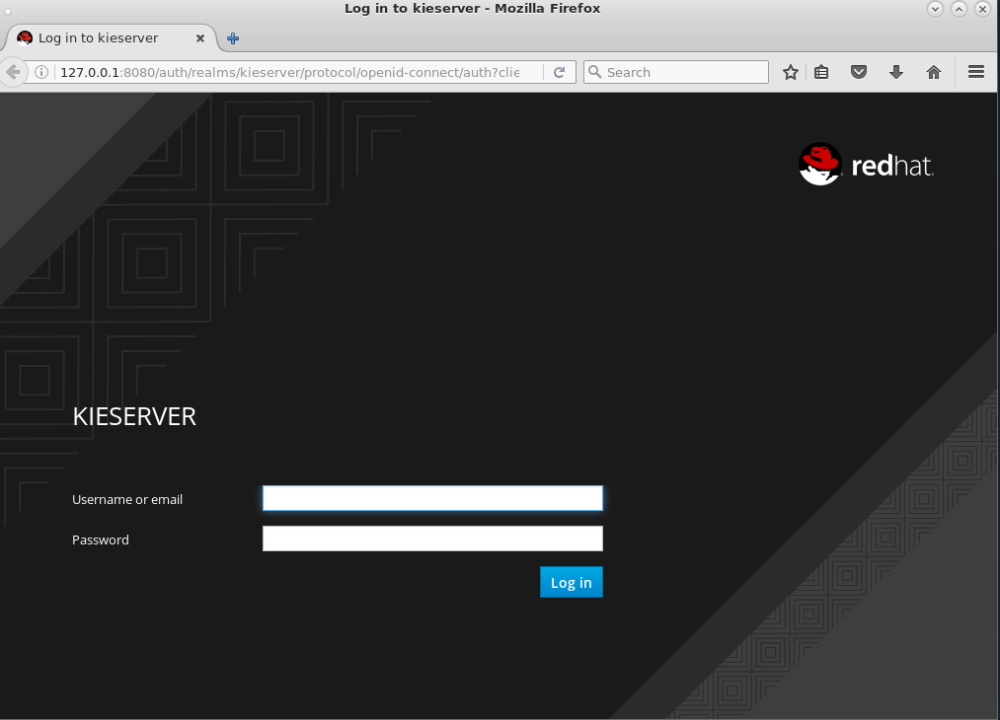
. Log in with one of the users thate were created in the `Kieserver` realm on the RH SSO server, e.g. `user1:user`.
. The browser window is redirected to the AngularJS application, and access is granted to user 1.
+
image::images/angular-client-screen.png[]
. From there on, you can start interacting with processes and tasks. +
_Create Ticket_ will launch a new process instance of the ticket process. +
_My Tickets_ will show a paginated list of tasks assigned to the logged in user.
. For example, click on `Create Ticket`, and fill in some values for `Project`, `Subject` and `Description` (these will be passed as process variables to the process instance). Assign the ticket to `group1` (to which user1 belongs). Click `Create the ticket`. +
You should see a confirmation screen, with a ticket reference, which corresponds to the process instance id of the created process.
. Click on `My Tickets`. You should see the new ticket in the list.
+
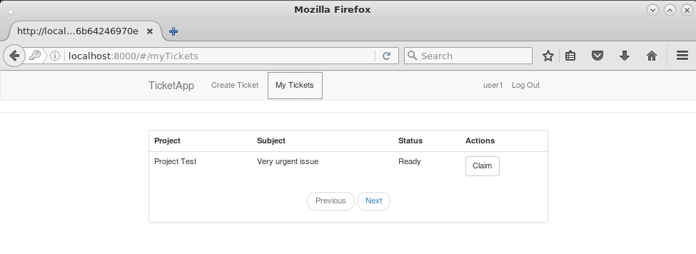
. Click on `Claim`, and then on `Start` to claim and start the task. +
Click on `View` to view the task. From there you can add comments, save the task, or complete it.
+
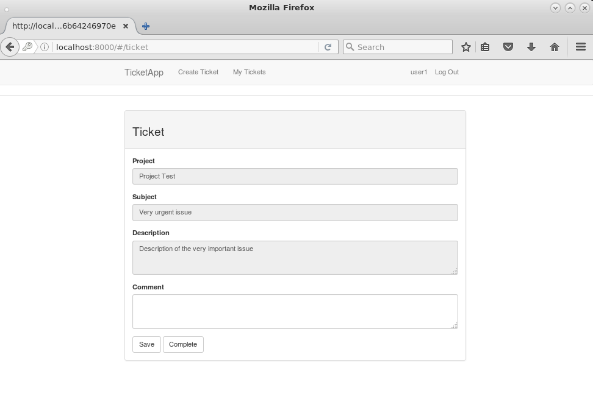

To login as another user, click the `Log out` link in the navigation bar. This will force a logout on the RH SSO server, and cause a redirect to the RH SSO login page.

=== A closer look at the AngularJS code

If you are interested how all this works on the AngularJS side, you should have a look at the code.

When the application starts, the RH SSO adapter is initiated, causing a redirect to the RH SSO server login page.   Upon successful login, the AngularJS framework is bootstrapped. +
All this happens in the `app/scripts/app.js` script, in the `initializeKeyCloak` function

----
    function initializeKeycloak() {
        var keycloakConfig = {
            "url": "http://" + ENV.rhsso_host + ":" + ENV.rhsso_port + "/auth",
            "realm": ENV.rhsso_realm,
            "clientId": ENV.rhsso_clientId,
            "credentials": {
                "secret": ENV.rhsso_secret
            }
        };
        var keycloak = Keycloak(keycloakConfig);
        keycloak.init({
            onLoad: 'login-required'
        }).success(function () {
            keycloak.loadUserInfo().success(function (userInfo) {
                bootstrapAngular(keycloak, userInfo);
            });
        });
    }
----

In the `app.js` script, a scheduled job runs that checks the validity of the token obtained through the login process, and will renew the token if it is valid for less than 5 minutes. +
The token is stored in the root scope of the app.

----
        .run(function ($rootScope, $http, $interval) {
            var updateTokenInterval = $interval(function () {
                // refresh token if it's valid for less then 15 minutes
                keycloak.updateToken(15)
                    .success(function (refreshed) {
                        if (refreshed) {
                            $rootScope.token = keycloak.token;
                        }
                    });
            }, 30000);

            $rootScope.token = keycloak.token;
            $rootScope.state={};

            $rootScope.userLogout = function () {
                $rootScope.token="";
                $interval.cancel(updateTokenInterval);
                keycloak.logout();
            };

            $rootScope.currentUser = {
                username: userInfo.name || userInfo.preferred_username,
                roles: keycloak.realmAccess.roles
            };
        })
----

Every time a request to the REST API of KIE Server is made, the token is set in the `Authorization` header of the request. +
For example, to get the list of tasks assigned to the logged in user (in `app/scripts/controllers/mytickets.js`):

----
        $scope.getMyTickets = function(page) {

            if (page < 0) {
                page = 0;
            }

            $scope.data.page = page;

            var url = util.getKieServerUrl()
                + "/kie-server/services/rest/server/queries/tasks/instances/pot-owners"
                + "?page=" + page;

            $http.defaults.headers.common.Authorization = 'Bearer ' + $scope.token;
            $http.defaults.headers.common['Accept'] = "application/json";
            $http.get(url)
                .success(function (data) {
                    $scope.data.result = data['task-summary'];
                })
                .error(function (error) {
                    $scope.data.error = {};
                    $scope.data.error.code = 'getMyTickets';
                    $scope.data.error.message = 'The ticket list could not be retrieved.'
                });

        };
----
